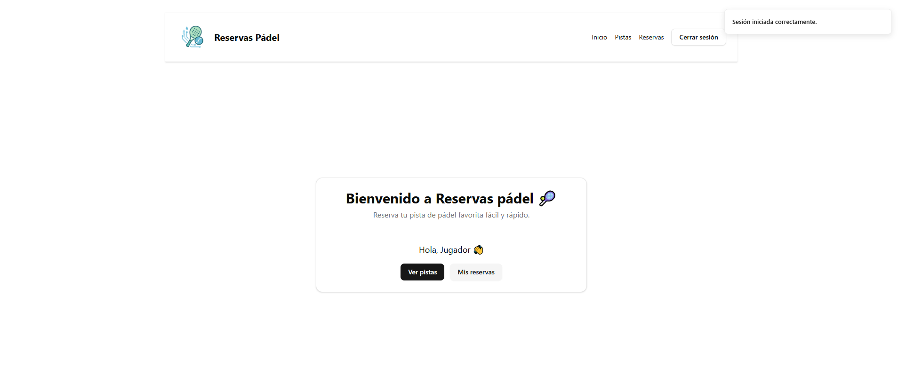
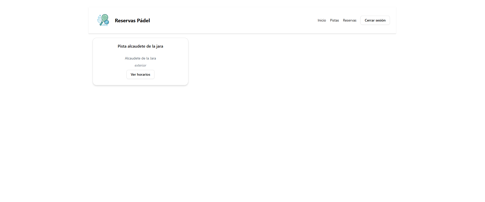
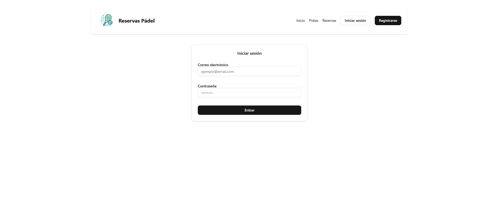
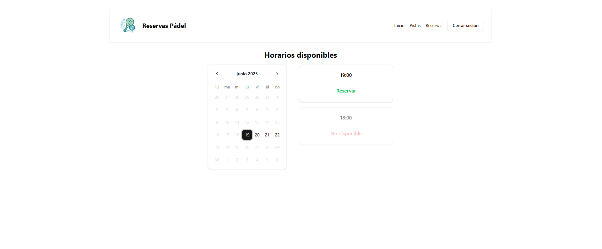
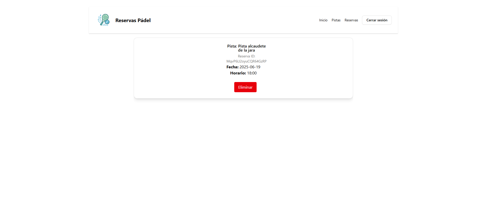
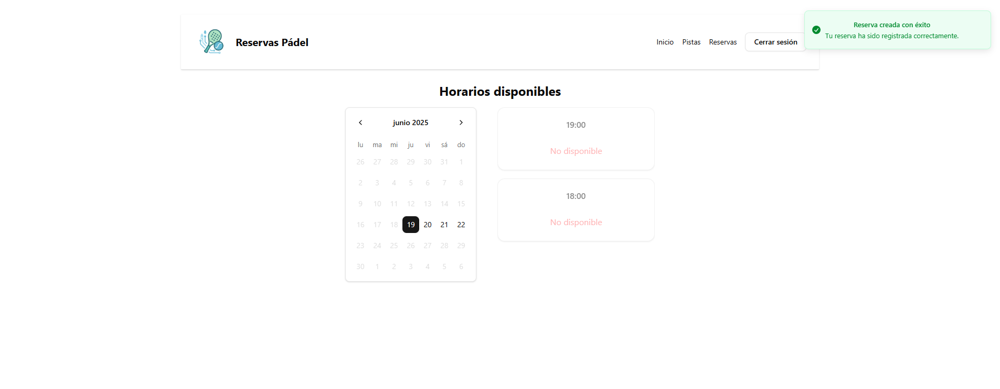
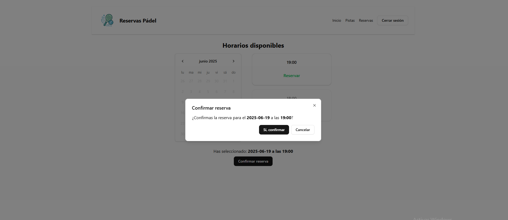

# 🎾 App de Reservas de Pistas de Pádel

Una aplicación web para gestionar reservas de pistas de pádel, con autenticación de usuarios, horarios disponibles, creación y cancelación de reservas. Diseñada con una interfaz moderna, rápida y responsiva.

## 🚀 Tecnologías utilizadas

### 🧠 Backend
- **Flask** - Framework web en Python.
- **Firebase Admin SDK** - Autenticación y Firestore.
- **Firestore** - Base de datos NoSQL en tiempo real.

### 🖼️ Frontend
- **React + Vite** - Framework moderno y rápido.
- **Firebase Authentication** - Login con correo y contraseña.
- **TailwindCSS + ShadCN** - Estilos modernos y componentes UI.
- **Sonner** - Notificaciones elegantes.
- **Context API + Hooks personalizados** - Manejo de sesión y datos.

## ✨ Funcionalidades principales

- Registro e inicio de sesión de usuarios.
- Consulta de pistas y horarios disponibles por fecha.
- Creación y cancelación de reservas.
- Vista de reservas del usuario con información detallada.
- Interfaz adaptada a móvil y escritorio.
- Skeletons para carga fluida.
- Protección con token JWT mediante Firebase.

## 🖼️ Capturas de pantalla

### Página principal


### Pistas


### Login


### Horarios


### Reservas


### Reservar


### Confirmación reserva


## 📦 Instalación local

### 1. Clona el repositorio

```bash
git clone https://github.com/jmontesv/frontend-reservas-padel.git
cd frontend-reservas-padel
```
### 2. Instalar dependencias e iniciar servidor de desarrollo

```bash
npm install 
npm run dev
```


